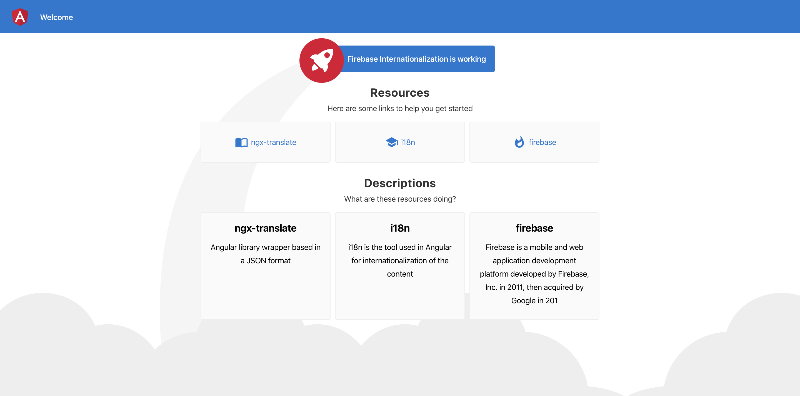

# Firebase Internationalization

> Angula project with Firebase and internationalization support




## Requirements

* [Node](https://nodejs.org/en/)
* [Angular CLI](https://github.com/angular/angular-cli)


## Goal

The Goal of this application is to show the use of [ngx-traslate](https://github.com/ngx-translate/core) alongside a custom pipe to localize all the elemens of an Angular project

## Setup

1. Download node and run the following command

```
npm install
```

2. Download Angular CLI

3. To start development livewatch just run  the following command

```
ng serve
```

## Code scaffolding

Run `ng generate component component-name` to generate a new component. You can also use `ng generate directive|pipe|service|class|guard|interface|enum|module`.

## Build

Run `ng build` to build the project. The build artifacts will be stored in the `dist/` directory. Use the `--prod` flag for a production build.

## Running unit tests

Run `ng test` to execute the unit tests via [Karma](https://karma-runner.github.io).

## Running end-to-end tests

Run `ng e2e` to execute the end-to-end tests via [Protractor](http://www.protractortest.org/).

## Meta

Lucas Fernandez – [@lucferbux](https://twitter.com/lucferbux) – lucas.fernandezaragon@telefonica.com

Distributed under the MIT license. See ``LICENSE`` for more information.
